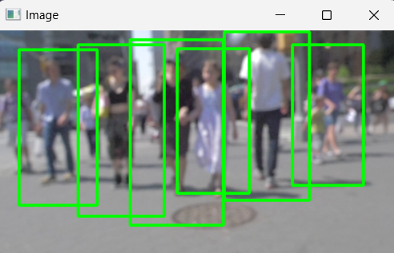

# Verzeo-project

This repository consist of two projects mainly person detection using OpenCV and ANN using Sonar Dataset.

## ANN using Sonar Dataset
This project involves building a machine learning model to classify sonar signals as either rocks or mines (metal cylinders). The dataset used is the Sonar Mines vs Rocks dataset, which contains continuous attributes gathered from sonar signals bounced off various surfaces. The goal is to accurately classify the objects based on the provided features.

### Dataset

The **Sonar Mines vs Rocks** dataset is used in this project. It contains **208 instances** with **60 continuous attributes** each, which represent the energy of sonar signals at different frequencies. The goal is to classify these instances as either rocks or mines based on the sonar signal characteristics.

- **Source**: [UCI Machine Learning Repository](https://archive.ics.uci.edu/dataset/151/connectionist+bench+sonar+mines+vs+rocks)
- **Features**: 60 numerical attributes, each ranging from 0.0 to 1.0, representing the energy levels at different sonar frequencies.
- **Classes**:
  - `R`: Rock
  - `M`: Mine

### Project Workflow

 -  **Data Exploration and Preprocessing**
 - **Model Selection and Training**
 - **Model Evaluation**
 -  **Visualization**
 - **Results and Findings**


## Person Detection using OpenCV

This project implements person detection using OpenCV's HOG (Histogram of Oriented Gradients) and SVM (Support Vector Machine) descriptor. The script processes a video file to detect people in each frame and saves the processed video with bounding boxes around detected individuals.

### Features
- Detect people in a video using HOG + SVM.
- Save the processed video with bounding boxes.
- Command-line interface to specify input file.


#### Installation

1. **Clone the repository** (if not already in your workspace):

    ```bash
    git clone https://github.com/yourusername/verzeo-project.git
    cd verzeo-project/main-project
    ```

2. **Create and activate a virtual environment** (optional but recommended):

    ```bash
    python -m venv venv
    source venv/bin/activate  # On Windows use `venv\Scripts\activate`
    ```

3. **Install the required packages**:

    ```bash
    pip install opencv-python imutils numpy argparse
    ```

## Usage

### Command-line Arguments

- `--video` or `-v`: Path to the input video file.

### Running the Script


Run the script with the video file as input and specify the output file path:

```bash
python person_detection.py --video "path/to/input/video.mp4"
```


### Output

- The script will detect people in the video and draw bounding boxes around them.
- The image below shows an example output where multiple individuals are detected and highlighted with green bounding boxes.




### Enhancements

- **Custom Training**: For more specific detection (e.g., detecting only walking pedestrians), consider training a custom model or using a pre-trained deep learning model like YOLO or SSD, which may offer more precision based on their training data.

## License

This project is licensed under the MIT License - see the [LICENSE](LICENSE) file for details.
